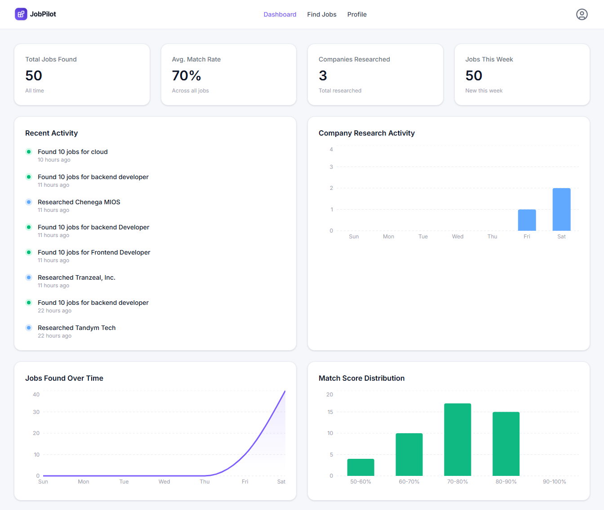
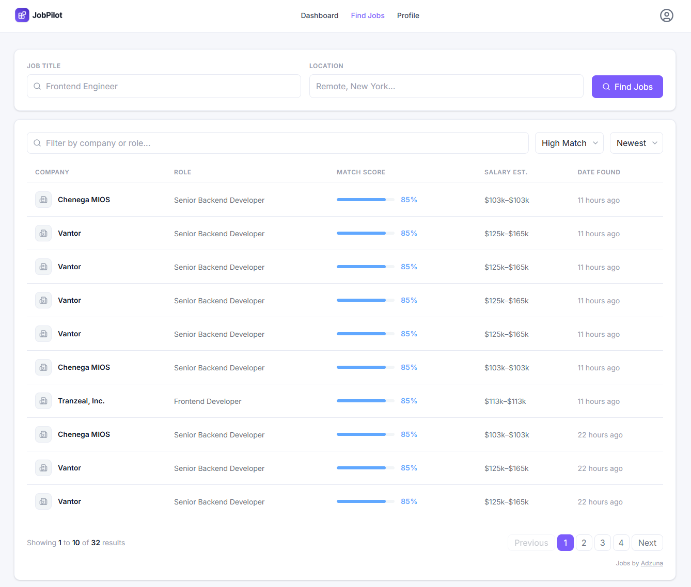
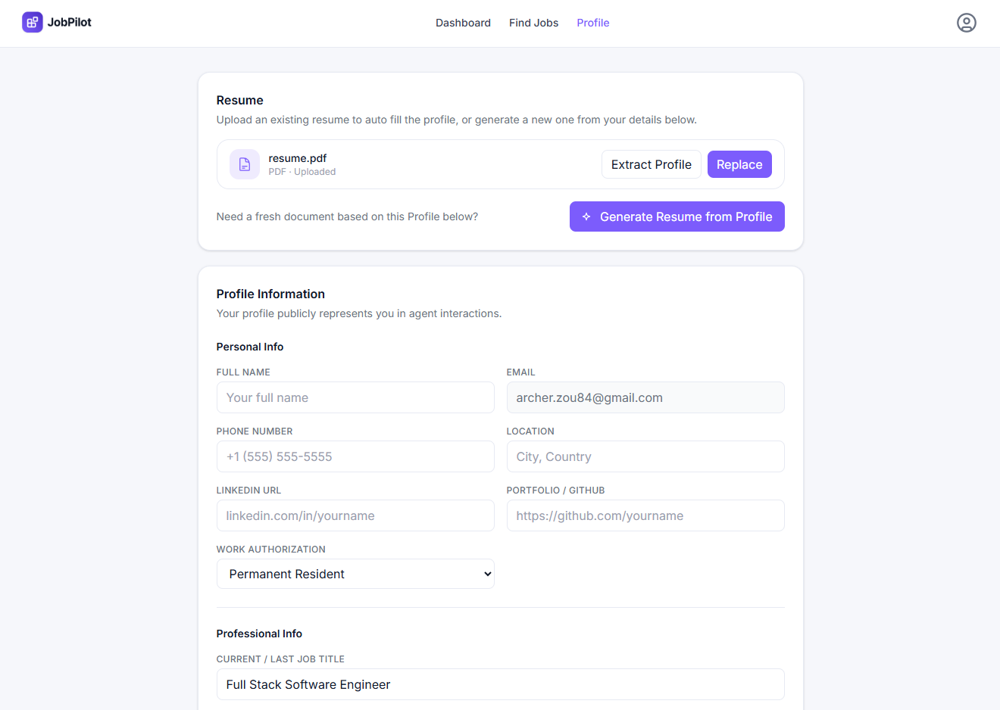

# JobPilot

An AI-powered job search assistant that finds relevant jobs, scores them against your profile, researches companies, and generates tailored resumes.

## Features

- **AI Job Discovery** — Search jobs via Adzuna, then score each result against your profile using GPT-4o in a single batch call
- **Match Scoring** — Every job gets a 0–100 match score with reasoning and matched/gap skill badges
- **Company Research Agent** — Browserbase + Stagehand browser agent scrapes the company's homepage and sub-pages, then synthesises a 9-field dossier (tech stack, culture, your edge, interview prep, smart questions)
- **AI Profile Extraction** — Upload a PDF resume; GPT-4o extracts and pre-fills your full profile
- **Resume Generation** — Generate a tailored PDF resume from your profile using GPT-4o content + `@react-pdf/renderer`
- **Analytics Dashboard** — Real DB data charts: jobs found over time, company research activity, match score distribution
- **Auth** — Google and GitHub OAuth via InsForge SSR auth with PKCE

## Screenshots

### Dashboard


### Find Jobs


### Profile


## Tech Stack

| Layer | Technology |
|---|---|
| Framework | Next.js 16 (App Router) |
| Language | TypeScript |
| Styling | Tailwind CSS 3.4 |
| Database / Auth / Storage | InsForge (`@insforge/sdk`) |
| AI | OpenAI GPT-4o via `openai` SDK |
| Job Data | Adzuna API |
| Browser Automation | Browserbase + Stagehand v3 |
| PDF Generation | `@react-pdf/renderer` |
| PDF Parsing | `pdf-parse` v1 |
| Analytics | PostHog |
| Charts | Recharts |

## Project Structure

```
app/
  dashboard/          # Dashboard with stats, activity feed, charts
  find-jobs/          # Job search + results table; [id]/ job details
  profile/            # Profile form, resume upload/generate/extract
  api/
    agent/find/       # Job discovery + batch scoring agent
    agent/research/   # Company research agent
    auth/             # OAuth callback, logout
    jobs/             # DB-backed job list with filters + pagination
    resume/generate/  # GPT-4o resume generation + PDF render
    resume/download/  # Signed PDF download

agent/
  find.ts             # batchScoreJobs, captureJobSearchEvents
  research.ts         # runCompanyResearch (Browserbase + GPT-4o)

components/
  dashboard/          # StatsBar, RecentActivity, chart components
  find-jobs/          # SearchControls, JobFilters, JobsTable, JobsPagination
  job-details/        # JobActions, JobInfo, MatchScore, JobDescription, CompanyResearch
  layout/             # Navbar (desktop avatar panel + mobile hamburger)
  profile/            # ProfileForm, ResumeSection, ProfileAttentionBanner
  homepage/           # Hero, Features, HowItWorks, CTASection, Footer

lib/
  auth.ts             # getServerClient, getUser, requireUser
  adzuna.ts           # searchJobs HTTP helper
  posthog-server.ts   # Typed server-side PostHog client
  utils.ts            # Match score colours, formatDate, formatSalary

proxy.ts              # Next.js 16 route protection (checks access token cookie)
```

## Environment Variables

```bash
# InsForge
NEXT_PUBLIC_INSFORGE_URL=
NEXT_PUBLIC_INSFORGE_ANON_KEY=

# PostHog
NEXT_PUBLIC_POSTHOG_PROJECT_TOKEN=
NEXT_PUBLIC_POSTHOG_HOST=

# OpenAI
OPENAI_API_KEY=

# Adzuna
ADZUNA_APP_ID=
ADZUNA_APP_KEY=

# Browserbase
BROWSERBASE_API_KEY=
BROWSERBASE_PROJECT_ID=
```

## Getting Started

```bash
npm install
cp .env.example .env.local   # fill in the variables above
npm run dev
```

Open [http://localhost:3000](http://localhost:3000).

## Database Schema

Four tables managed via InsForge migrations with full RLS:

| Table | Purpose |
|---|---|
| `profiles` | User profile, work experience, education, job preferences |
| `jobs` | Discovered jobs with match scores, descriptions, company research dossier |
| `agent_runs` | Log of each find-jobs or research run |
| `agent_logs` | Per-step agent log entries |

A `resumes` private storage bucket holds uploaded and generated PDF resumes scoped per user.
